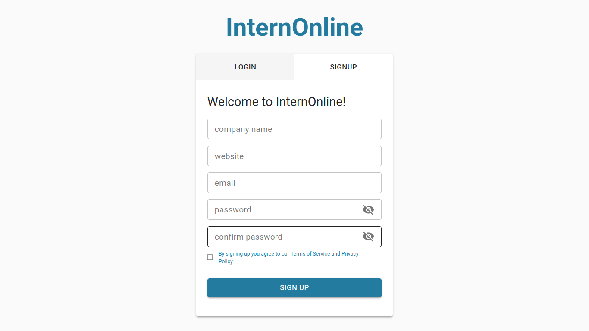
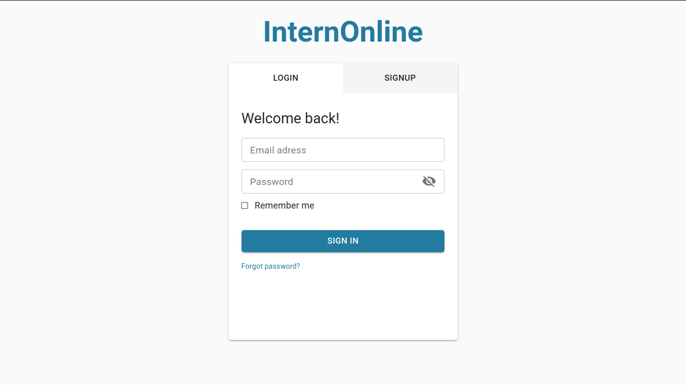
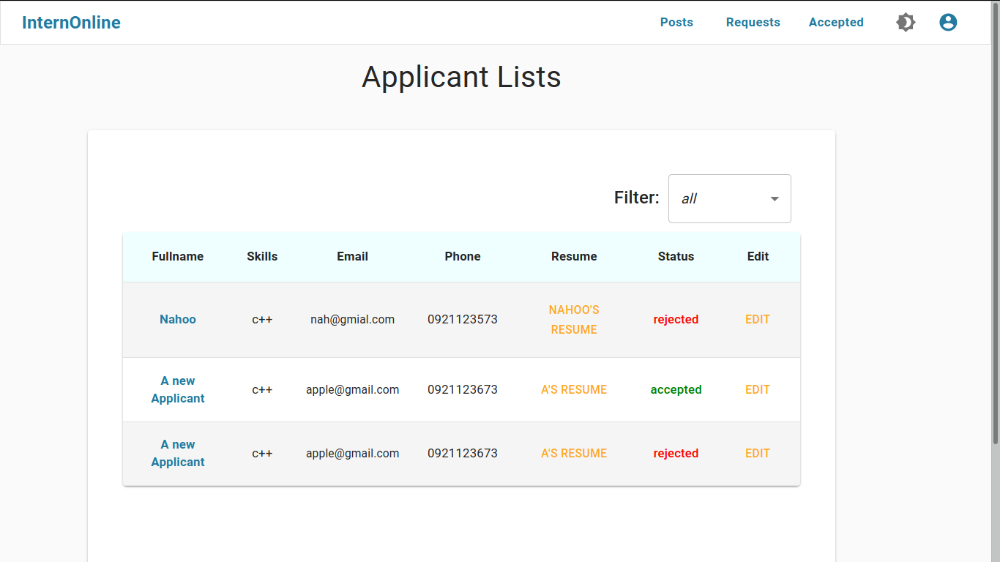
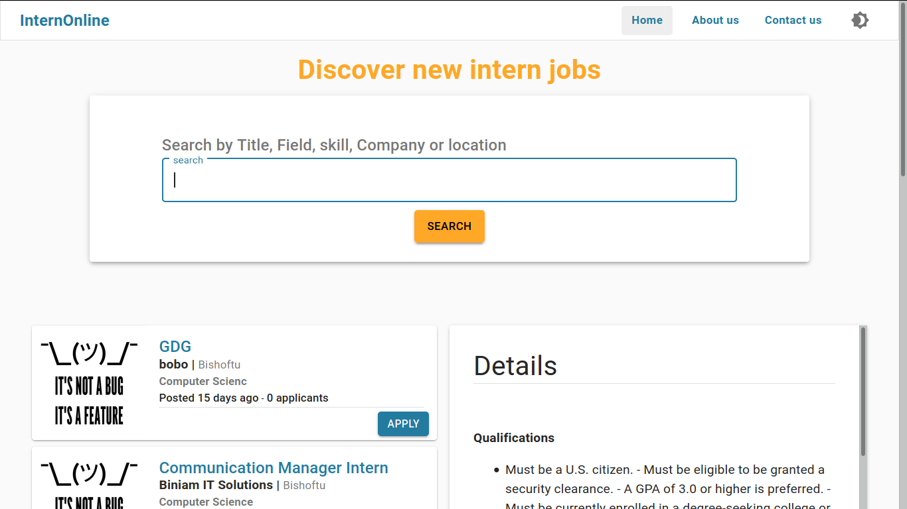
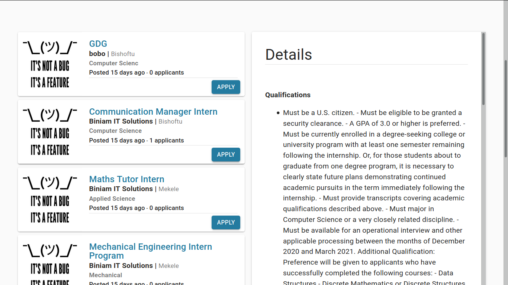

# A web-app for finding Internship jobs!
Build with MERN stack(Mongod-DB, Express, React, Node)
Companis creat account and post intern jobs. Then they can see applicant list and approv, reject or pend application.
User can see latest posts or they can search and filter intern jobs by company name, location, field, duration etc...and apply.
Here are some of the screen shots.
Frontend is build with material-ui.

## Signup

## Login

## Applicant list

## Home page

## Intern List

